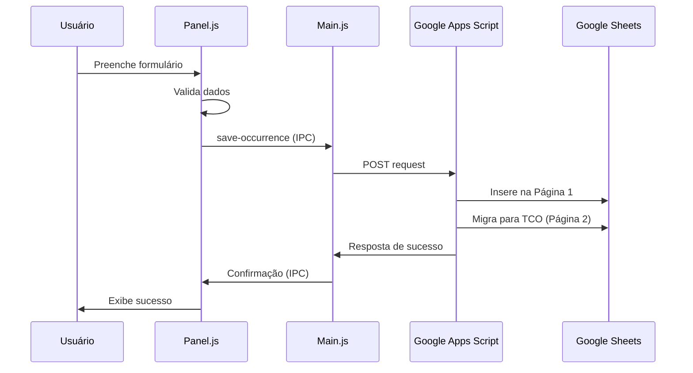
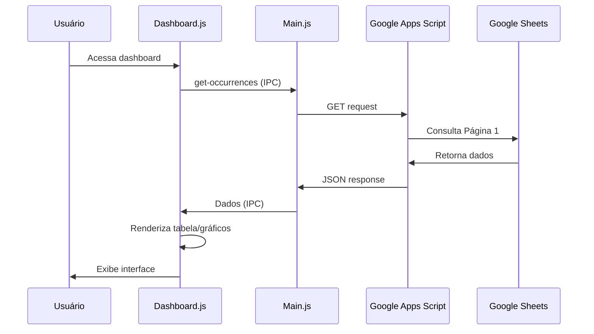
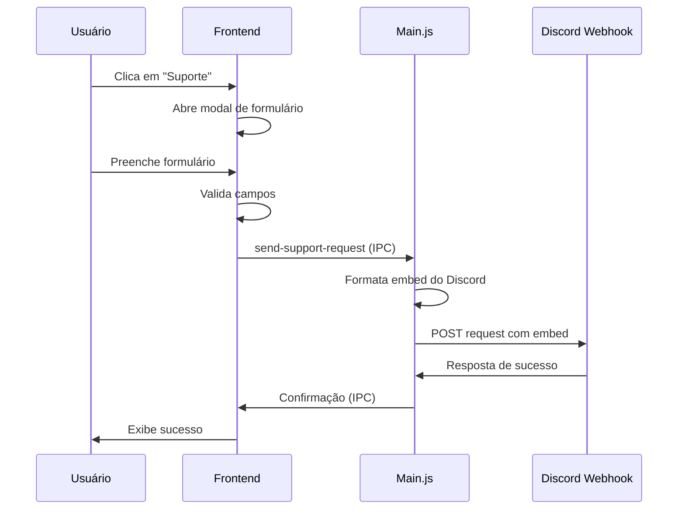
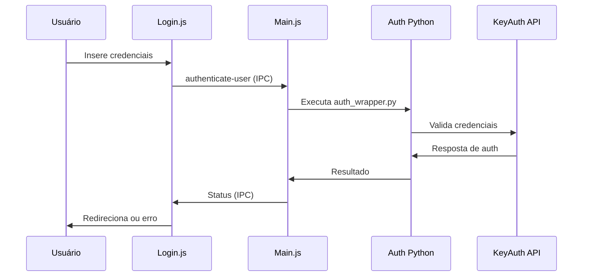

# Documentação Técnica - SECRIMPO PMDF

## Índice

1. [Visão Geral](#visão-geral)
2. [Arquitetura do Sistema](#arquitetura-do-sistema)
3. [Estrutura de Arquivos](#estrutura-de-arquivos)
4. [Componentes Principais](#componentes-principais)
5. [Fluxo de Dados](#fluxo-de-dados)
6. [APIs e Integrações](#apis-e-integrações)
7. [Sistema de Autenticação](#sistema-de-autenticação)
8. [Base de Dados](#base-de-dados)
9. [Interface do Usuário](#interface-do-usuário)
10. [Sistema de Build](#sistema-de-build)
11. [Configuração e Deploy](#configuração-e-deploy)
12. [Troubleshooting](#troubleshooting)

---

## Visão Geral

O SECRIMPO PMDF é uma aplicação desktop desenvolvida em Electron que gerencia ocorrências policiais da Polícia Militar do Distrito Federal. O sistema integra múltiplas tecnologias para oferecer uma solução completa de registro, consulta e relatórios.

### Tecnologias Principais

- **Frontend**: Electron, HTML5, CSS3, JavaScript ES6+
- **Backend**: Node.js, Python
- **Integração**: Google Apps Script, Google Sheets
- **Autenticação**: KeyAuth
- **Gráficos**: Chart.js
- **Processamento**: Tesseract.js (OCR), Mammoth (Word), PDF.js

---

## Arquitetura do Sistema

### Diagrama de Componentes

```
┌─────────────────┐    ┌─────────────────┐    ┌─────────────────┐
│   Frontend      │    │   Backend       │    │   Integração    │
│   (Electron)    │◄──►│   (Node.js)     │◄──►│   (Google)      │
│                 │    │                 │    │                 │
│ • HTML/CSS/JS   │    │ • IPC Handlers  │    │ • Apps Script   │
│ • Chart.js      │    │ • File System   │    │ • Sheets API    │
│ • UI Components │    │ • Process Mgmt  │    │ • Drive API     │
└─────────────────┘    └─────────────────┘    └─────────────────┘
         │                       │                       │
         │                       │                       │
         ▼                       ▼                       ▼
┌─────────────────┐    ┌─────────────────┐    ┌─────────────────┐
│  Autenticação   │    │   Atualizações  │    │   Relatórios    │
│   (Python)      │    │   (GitHub)      │    │   (Excel/PDF)   │
│                 │    │                 │    │                 │
│ • KeyAuth       │    │ • Auto-updater  │    │ • XLSX Export   │
│ • HWID Check    │    │ • Version Check │    │ • PDF Generate  │
│ • Session Mgmt  │    │ • Download Mgmt │    │ • Print System │
└─────────────────┘    └─────────────────┘    └─────────────────┘
```

### Fluxo de Comunicação

1. **Renderer Process** (Frontend) ↔ **Main Process** (Backend) via IPC
2. **Main Process** ↔ **Python Auth** via Child Process
3. **Main Process** ↔ **Google Apps Script** via HTTPS
4. **Apps Script** ↔ **Google Sheets** via Sheets API

---

## Estrutura de Arquivos

```
SecrimpoPMDF/
├── src/                              # Código fonte principal
│   ├── main.js                       # Processo principal Electron
│   ├── views/                        # Páginas HTML
│   │   ├── login.html               # Tela de autenticação
│   │   ├── dashboard.html           # Interface principal
│   │   ├── panel.html               # Formulário de ocorrências
│   │   └── pdf_viewer.html          # Visualizador de PDF
│   ├── scripts/                      # Lógica JavaScript
│   │   ├── login.js                 # Autenticação frontend
│   │   ├── dashboard.js             # Dashboard e tabelas
│   │   ├── panel.js                 # Formulário e validação
│   │   ├── fileExtractor.js         # Extração de documentos
│   │   ├── autocomplete.js          # Auto-completar campos
│   │   ├── custom-alert.js          # Sistema de alertas
│   │   └── leisBrasileiras.js       # Base de leis brasileiras
│   ├── styles/                       # Folhas de estilo
│   │   ├── login.css                # Estilos da autenticação
│   │   ├── dashboard.css            # Estilos do dashboard
│   │   ├── panel.css                # Estilos do formulário
│   │   ├── pdf_viewer.css           # Estilos do visualizador
│   │   ├── custom-alert.css         # Estilos dos alertas
│   │   └── autocomplete.css         # Estilos do autocomplete
│   ├── templates/                    # Templates de documentos
│   │   └── termo_apreensao.html     # Template do termo
│   └── updater/                      # Sistema de atualizações
│       ├── updater.js               # Lógica de atualização
│       ├── update-client.js         # Cliente de atualização
│       └── update-window.html       # Interface de atualização
├── auth/                             # Sistema de autenticação
│   ├── auth_wrapper.py              # Wrapper principal Python
│   ├── keyauth.py                   # Biblioteca KeyAuth
│   ├── get_online_users.py          # Contador de usuários
│   ├── requirements.txt             # Dependências Python
│   └── dist/                        # Executáveis compilados
├── assets/                           # Recursos estáticos
│   └── App_Logo.ico                 # Ícone da aplicação
├── google-apps-script.gs             # Script do Google Sheets
├── build-completo.bat               # Script de build automático
├── package.json                     # Configuração Node.js
├── README.md                        # Documentação do usuário
├── CHANGELOG.md                     # Histórico de versões
└── DOCUMENTATION.md                 # Esta documentação
```

---

## Componentes Principais

### 1. Main Process (src/main.js)

**Responsabilidades:**
- Gerenciamento de janelas Electron
- Comunicação IPC entre processos
- Integração com APIs externas
- Gerenciamento de arquivos e sistema

**Handlers IPC Principais:**
```javascript
// Autenticação
'authenticate-user'          // Autenticar usuário via KeyAuth
'get-online-users'          // Obter contagem de usuários online

// Ocorrências
'save-occurrence'           // Salvar nova ocorrência
'get-occurrences'          // Buscar ocorrências
'update-occurrence'        // Atualizar ocorrência existente
'delete-occurrence'        // Excluir ocorrência
'export-occurrences'       // Exportar para Excel

// TCO
'get-tcos'                 // Buscar TCOs
'update-tco'               // Atualizar TCO
'delete-tco'               // Excluir TCO
'export-tcos'              // Exportar TCOs para Excel

// Sistema
'load-panel'               // Carregar painel de ocorrências
'check-updates-manual'     // Verificar atualizações manualmente
'open-external-url'        // Abrir URL externa (download de atualização)

// Suporte
'send-support-request'     // Enviar solicitação de suporte para Discord
```

### 2. Dashboard (src/scripts/dashboard.js)

**Funcionalidades:**
- Renderização de tabelas de ocorrências e TCOs
- Gráficos interativos com Chart.js
- Sistema de filtros avançados com modais dedicados
- Modais de visualização e edição
- Exportação de dados com filtros
- Sistema de atualizações automáticas

**Componentes Principais:**
```javascript
// Gráficos
createLineChart()           // Gráfico de evolução temporal
createPieChartUnidade()     // Distribuição por unidades
createPieChartItens()       // Tipos de itens apreendidos

// Tabelas
renderOccurrenceTable()    // Renderizar tabela de ocorrências
renderTCOTable()           // Renderizar tabela de TCOs

// Filtros
applyOccurrenceFilters()   // Aplicar filtros de ocorrências
applyTCOFilters()          // Aplicar filtros de TCOs
clearOccurrenceFilters()   // Limpar filtros de ocorrências
clearTCOFilters()          // Limpar filtros de TCOs
populateStatusOptions()    // Preencher opções de status
populateIlicitoOptions()   // Preencher opções de ilícito

// Modais
showModal()                // Exibir modal de ocorrência
showTCOModal()             // Exibir modal de TCO

// Exportação
exportToExcel()            // Exportar dados para Excel

// Atualizações
checkForUpdates()          // Verificar atualizações
showUpdateModal()          // Exibir modal de atualização
```

### 3. Panel (src/scripts/panel.js)

**Funcionalidades:**
- Formulário de registro de ocorrências
- Validação de campos
- Máscaras de entrada
- Integração com extração de documentos
- Sistema de suporte integrado

**Validações Implementadas:**
```javascript
// CPF/CNPJ
validateCPF()              // Validar CPF
validateCNPJ()             // Validar CNPJ

// Datas
validateDate()             // Validar formato de data
updateGenesisYear()        // Atualizar ano no Genesis

// Campos obrigatórios
validateRequiredFields()   // Validar campos obrigatórios
```

**Sistema de Suporte:**
```javascript
// Modal de suporte
openSuporteModal()         // Abrir modal de suporte
closeSuporteModal()        // Fechar modal de suporte
submitSuporteForm()        // Enviar formulário de suporte
validateSuporteForm()      // Validar campos do formulário
```

### 4. File Extractor (src/scripts/fileExtractor.js)

**Funcionalidades:**
- Extração de texto de PDFs
- Processamento de documentos Word
- OCR de imagens
- Detecção automática de dados

**Métodos de Extração:**
```javascript
extractFromPDF()           // Extrair texto de PDF
extractFromWord()          // Extrair texto de Word
extractFromImage()         // OCR de imagens
detectCPF()               // Detectar CPF no texto
detectRG()                // Detectar RG no texto
detectNames()             // Detectar nomes
detectDates()             // Detectar datas
```

---

## Fluxo de Dados

### 1. Registro de Ocorrência



### 2. Consulta de Dados



### 3. Sistema de Suporte



### 4. Autenticação



---

## APIs e Integrações

### 1. Google Apps Script

**URL Base:** `Credencial Removida`

**Endpoints:**

#### GET Requests
```javascript
// Buscar ocorrências
GET /?action=get_occurrences
Response: { success: true, occurrences: [...] }

// Buscar TCOs
GET /?action=get_tcos
Response: { success: true, tcos: [...] }
```

#### POST Requests
```javascript
// Salvar ocorrência
POST / { action: 'save', ...dadosOcorrencia }
Response: { success: true, message: "..." }

// Atualizar ocorrência
POST / { action: 'update', id: "...", ...dadosAtualizados }
Response: { success: true, message: "..." }

// Excluir ocorrência
POST / { action: 'delete', id: "..." }
Response: { success: true, message: "..." }

// Adicionar TCO
POST / { action: 'add_tco', ...dadosTCO }
Response: { success: true, message: "..." }

// Atualizar TCO
POST / { action: 'update_tco', id: "...", ...dadosAtualizados }
Response: { success: true, message: "..." }

// Excluir TCO
POST / { action: 'delete_tco', id: "..." }
Response: { success: true, message: "..." }
```

### 2. KeyAuth API

**Configuração:**
```python
KEYAUTH_NAME = "Credencial Removida"
KEYAUTH_OWNERID = "Credencial Removida"
KEYAUTH_VERSION = "Credencial Removida"
```

**Métodos Utilizados:**
```python
keyauth.license(license_key)    # Validar licença
keyauth.log("message")          # Log de atividade
keyauth.fetchOnline()           # Usuários online
```

### 3. GitHub Releases API

**URL:** `https://api.github.com/repos/SalvaSolucoes/secrimpo/releases/latest`

**Uso:** Verificação automática de atualizações

**Funcionalidades:**
- Verificação automática uma vez por dia ao abrir a aplicação
- Verificação manual via botão no menu do usuário
- Comparação de versões usando versionamento semântico
- Armazenamento local da última verificação
- Tratamento de erros (rate limit, repositório não encontrado, etc.)
- Modal de notificação com informações da nova versão

### 4. Discord Webhook API

**URL:** Configurada em `src/main.js` (variável `DISCORD_WEBHOOK_URL`)

**Uso:** Envio de solicitações de suporte para canal do Discord

**Funcionalidades:**
- Envio de embeds formatados com informações do suporte
- Notificação automática com @everyone
- Cores dinâmicas baseadas na prioridade
- Formatação de data e hora em português brasileiro
- Tratamento de descrições longas (limite de 1000 caracteres)

**Estrutura do Embed:**
```javascript
{
  title: 'Nova Solicitação de Suporte',
  color: embedColor, // Baseado na prioridade
  fields: [
    { name: 'Solicitante', value: '...' },
    { name: 'Unidade', value: '...' },
    { name: 'Prioridade', value: '...' },
    { name: 'Problema', value: '...' },
    { name: 'Descrição', value: '...' },
    { name: 'Data e Hora', value: '...' }
  ],
  timestamp: '...',
  footer: { text: 'SECRIMPO PMDF - Sistema de Suporte' }
}
```

**Prioridades e Cores:**
- **Urgente**: Vermelho (0xff0000)
- **Alta**: Laranja (0xff6600)
- **Média**: Amarelo (0xffaa00)
- **Baixa**: Verde (0x00ff00)
- **Padrão**: Azul escuro (0x071d49)

---

## Sistema de Autenticação

### Arquitetura

```
┌─────────────────┐    ┌─────────────────┐    ┌─────────────────┐
│   Frontend      │    │   Main Process  │    │   Python Auth   │
│   (login.js)    │◄──►│   (main.js)     │◄──►│ (auth_wrapper)  │
└─────────────────┘    └─────────────────┘    └─────────────────┘
                                                        │
                                                        ▼
                                               ┌─────────────────┐
                                               │   KeyAuth API   │
                                               │   (Servidor)    │
                                               └─────────────────┘
```

### Fluxo de Autenticação

1. **Usuário insere credenciais** no frontend
2. **Frontend envia** via IPC para main process
3. **Main process executa** `auth_wrapper.py`
4. **Python script valida** via KeyAuth API
5. **Resposta retorna** através da cadeia
6. **Frontend redireciona** baseado no resultado

### Códigos de Erro

```python
# Códigos de sucesso
0   # Login realizado com sucesso

# Códigos de erro de autenticação (1-19)
1   # Credenciais inválidas
2   # Usuário não encontrado
3   # Licença expirada
4   # Hardware ID inválido
5   # Máximo de sessões atingido

# Códigos de erro de conexão (20-39)
20  # Erro de conexão com internet
21  # Servidor KeyAuth indisponível
22  # Timeout na requisição

# Códigos de erro do sistema (40-59)
40  # Erro interno do sistema
41  # Arquivo de configuração não encontrado
42  # Erro de permissão
```

---

## Base de Dados

### Google Sheets Structure

#### Página 1 - Ocorrências (Colunas A-S)

| Coluna | Campo | Tipo | Descrição |
|--------|-------|------|-----------|
| A | Log/Timestamp | DateTime | Data/hora do registro |
| B | Número Genesis | String | Identificador único |
| C | Unidade | String | Unidade policial |
| D | Data Apreensão | Date | Data da apreensão |
| E | Lei Infringida | String | LCP ou CP |
| F | Artigo | String | Artigo da lei |
| G | Status | String | Status atual |
| H | Espécie | String | Tipo do item |
| I | Item | String | Item apreendido |
| J | Quantidade | String | Quantidade |
| K | Descrição Item | String | Descrição detalhada |
| L | Nome Proprietário | String | Nome completo |
| M | Tipo Documento | String | CPF, RG, etc. |
| N | Número Documento | String | Número do documento |
| O | Nome Policial | String | Nome do policial |
| P | Matrícula | String | Matrícula do policial |
| Q | Graduação | String | Graduação do policial |
| R | Unidade Policial | String | Unidade do policial |
| S | Registrado Por | String | Usuário que registrou |

#### Página 2 - TCOs (Colunas A-C)

| Coluna | Campo | Tipo | Descrição |
|--------|-------|------|-----------|
| A | RAP (GÊNESIS) | String | Número Genesis da ocorrência |
| B | Envolvido | String | Nome do envolvido |
| C | Ilícito | String | Tipo de ilícito |

### Regras de Negócio

1. **Dados iniciam na linha 3** em ambas as páginas
2. **Conversão automática** para maiúsculas no backend
3. **Migração automática** de ocorrências para TCO
4. **IDs únicos** gerados automaticamente
5. **Validação de duplicatas** por RAP no TCO

### Estrutura de Pastas Locais

O sistema cria automaticamente a seguinte estrutura de pastas em `C:\SECRIMPO\`:

```
C:\SECRIMPO\
├── Ocorrencias\              # Backups JSON das ocorrências
│   └── [NumeroGenesis][dd.mm.yyyy].json
├── Exportacao\
│   ├── Ocorrencias\          # Exportações Excel de ocorrências
│   │   └── [EXPORTACAO][dd.mm.yyyy].xlsx
│   └── Tco\                  # Exportações Excel de TCOs
│       └── [EXPORTACAO_TCO][dd.mm.yyyy].xlsx
└── Termos\                   # PDFs de Termos de Apreensão
    └── [NumeroGenesis][dd.mm.yyyy].pdf
```

#### Descrição das Pastas

- **Ocorrencias/**: Armazena backups locais em formato JSON de todas as ocorrências registradas
- **Exportacao/Ocorrencias/**: Contém arquivos Excel exportados de ocorrências (com ou sem filtros)
- **Exportacao/Tco/**: Contém arquivos Excel exportados de TCOs (com ou sem filtros)
- **Termos/**: Armazena PDFs gerados dos Termos de Apreensão

**Nota**: Todas as pastas são criadas automaticamente na inicialização da aplicação.

---

## Interface do Usuário

### Sistema de Filtros

#### Filtros de Ocorrências
- **Nº Genesis**: Campo de texto para busca por número Genesis
- **Data de Apreensão**: Range de datas (inicial e final)
- **Unidade**: Dropdown preenchido dinamicamente com unidades únicas
- **Status**: Dropdown preenchido dinamicamente com status únicos
- **Persistência**: Filtros mantidos ao reabrir o modal
- **Combinação**: Filtros funcionam em conjunto (AND)
- **Indicador Visual**: Botão de filtro muda para cor verde quando há filtros ativos

#### Filtros de TCOs
- **RAP (Gênesis)**: Campo de texto para busca por RAP
- **Ilícito**: Dropdown preenchido dinamicamente com ilícitos únicos
- **Item**: Campo de texto para busca por item
- **Persistência**: Filtros mantidos ao reabrir o modal
- **Combinação**: Filtros funcionam em conjunto (AND)
- **Indicador Visual**: Botão de filtro muda para cor verde quando há filtros ativos

#### Indicador Visual de Filtros
- **Estado Padrão**: Botão cinza quando não há filtros aplicados
- **Estado Ativo**: Botão verde quando há filtros aplicados
- **Atualização Automática**: O estado visual é atualizado automaticamente ao:
  - Aplicar filtros
  - Limpar filtros
  - Carregar dados
  - Ativar a aba correspondente

### Sistema de Suporte

#### Formulário de Suporte
- **Acesso**: Menu dropdown do usuário → "Suporte"
- **Campos**:
  - Nome (preenchido automaticamente se disponível)
  - Unidade (dropdown: 8º BPM, 10º BPM, 16º BPM)
  - Prioridade (dropdown: Baixa, Média, Alta, Urgente)
  - Problema (campo de texto)
  - Descrição (textarea)
- **Validação**: Todos os campos são obrigatórios
- **Envio**: Assíncrono com feedback visual

#### Integração Discord
- **Webhook**: Configurado em `src/main.js`
- **Formato**: Embed do Discord
- **Notificação**: @everyone automático
- **Cores**: Dinâmicas baseadas na prioridade
- **Estrutura**: Campos verticais organizados

### Componentes Reutilizáveis

#### 1. Custom Alert System
```javascript
// Tipos de alerta
showAlert('success', 'Mensagem de sucesso');
showAlert('error', 'Mensagem de erro');
showAlert('warning', 'Mensagem de aviso');
showAlert('info', 'Mensagem informativa');
```

#### 2. Loading System
```javascript
// Exibir loading
showLoading('Salvando dados...');

// Ocultar loading
hideLoading();
```

#### 3. Modal System
```javascript
// Abrir modal
showModal(true);  // Modo edição
showModal(false); // Modo visualização

// Fechar modal
closeModal();
```

### Temas e Estilos

#### Paleta de Cores PMDF
```css
:root {
  --pmdf-blue: #1e3a8a;      /* Azul principal */
  --pmdf-light-blue: #3b82f6; /* Azul claro */
  --pmdf-dark-blue: #1e40af;  /* Azul escuro */
  --pmdf-gold: #fbbf24;       /* Dourado */
  --success-green: #10b981;    /* Verde sucesso */
  --error-red: #ef4444;        /* Vermelho erro */
  --warning-yellow: #f59e0b;   /* Amarelo aviso */
}
```

#### Responsividade
- **Desktop**: Layout completo com sidebar
- **Tablet**: Layout adaptado com menu colapsável
- **Mobile**: Layout vertical com navegação inferior

---

## Sistema de Build

### Build Automático (build-completo.bat)

#### Etapas do Build

1. **Limpeza de arquivos anteriores**
   ```batch
   rmdir /s /q dist
   rmdir /s /q build
   rmdir /s /q auth\dist
   ```

2. **Verificação de dependências**
   ```batch
   python --version
   node --version
   ```

3. **Instalação de dependências**
   ```batch
   npm install
   pip install -r auth/requirements.txt
   pip install pyinstaller
   ```

4. **Compilação Python**
   ```batch
   pyinstaller --onefile --noconsole --name auth_keyauth auth_wrapper.py
   ```

5. **Build Electron**
   ```batch
   npm run build:win
   ```

### Configuração Electron Builder

```json
{
  "build": {
    "appId": "com.salvasolucoes.secrimpo",
    "productName": "SECRIMPO PMDF",
    "compression": "maximum",
    "win": {
      "target": ["nsis", "portable"],
      "icon": "assets/App_Logo.ico"
    },
    "nsis": {
      "oneClick": false,
      "allowToChangeInstallationDirectory": true,
      "createDesktopShortcut": "always"
    }
  }
}
```

### Outputs do Build

- **Instalador**: `SECRIMPO PMDF.exe` (NSIS)
- **Portátil**: `SECRIMPO PMDF-Portable.exe`
- **Autenticação**: `auth/dist/auth_keyauth.exe`

---

## Configuração e Deploy

### Pré-requisitos de Desenvolvimento

1. **Node.js 16+**
   ```bash
   node --version
   npm --version
   ```

2. **Python 3.8+**
   ```bash
   python --version
   pip --version
   ```

3. **Git**
   ```bash
   git --version
   ```

### Configuração Inicial

1. **Clone do repositório**
   ```bash
   git clone https://github.com/Credencial Removida/Credencial Removida.git
   cd secrimpo
   ```

2. **Instalação de dependências**
   ```bash
   npm install
   pip install -r auth/requirements.txt
   ```

3. **Configuração do Google Sheets**
   - Criar planilha no Google Sheets
   - Configurar Google Apps Script
   - Atualizar URL no `main.js`

4. **Configuração KeyAuth**
   - Criar aplicação no KeyAuth
   - Atualizar credenciais em `auth_wrapper.py`

### Variáveis de Ambiente

```bash
# Desenvolvimento
NODE_ENV=development
ELECTRON_IS_DEV=true

# Produção
NODE_ENV=production
ELECTRON_IS_DEV=false
```

### Deploy em Produção

1. **Build completo**
   ```bash
   ./build-completo.bat
   ```

2. **Teste do executável**
   ```bash
   ./dist/SECRIMPO PMDF.exe
   ```

3. **Distribuição**
   - Upload para servidor de distribuição
   - Criação de release no GitHub
   - Notificação aos usuários

---

## Troubleshooting

### Problemas Comuns

#### 1. Erro de Autenticação
```
Código: 1-5
Causa: Credenciais inválidas, licença expirada, HWID
Solução: Verificar credenciais KeyAuth, renovar licença
```

#### 2. Erro de Conexão Google Sheets
```
Erro: Failed to fetch
Causa: URL incorreta, permissões, Apps Script
Solução: Verificar URL, testar endpoint, verificar permissões
```

#### 3. Erro de Build Python
```
Erro: PyInstaller failed
Causa: Dependências faltando, conflitos de versão
Solução: Reinstalar dependências, verificar versões
```

#### 4. Erro de Build Electron
```
Erro: electron-builder failed
Causa: Dependências Node.js, configuração incorreta
Solução: npm install, verificar package.json
```

### Logs e Debug

#### Localização dos Logs
```
Windows: %APPDATA%/SECRIMPO PMDF/logs/
Arquivo: main.log, renderer.log, auth.log
```

#### Ativação do Debug
```javascript
// main.js
const isDev = process.env.NODE_ENV === 'development';
if (isDev) {
  mainWindow.webContents.openDevTools();
}
```

#### Logs Python
```python
# auth_wrapper.py
import logging
logging.basicConfig(level=logging.DEBUG)
```

### Monitoramento

#### Métricas Importantes
- Taxa de sucesso de autenticação
- Tempo de resposta do Google Sheets
- Erros de sincronização
- Performance de extração de documentos

#### Alertas Configurados
- Falha de autenticação > 5%
- Tempo de resposta > 10s
- Erro de sincronização > 3 consecutivos

---

## Manutenção e Atualizações

### Ciclo de Atualizações

1. **Desenvolvimento** → Teste local
2. **Staging** → Teste em ambiente similar à produção
3. **Release** → Criação de release no GitHub
4. **Deploy** → Distribuição automática via updater

### Versionamento

Seguindo [Semantic Versioning](https://semver.org/):
- **MAJOR**: Mudanças incompatíveis
- **MINOR**: Novas funcionalidades compatíveis
- **PATCH**: Correções de bugs

### Backup e Recuperação

#### Dados do Google Sheets
- Backup automático do Google Drive
- Exportação manual periódica
- Versionamento de planilhas

#### Configurações Locais
```
Localização: %APPDATA%/SECRIMPO PMDF/
Arquivos: config.json, cache.json, logs/
```

---

## Segurança

### Medidas Implementadas

1. **Autenticação forte** via KeyAuth
2. **Validação de HWID** para controle de dispositivos
3. **Comunicação HTTPS** com APIs externas
4. **Validação de entrada** em todos os formulários
5. **Logs de auditoria** para ações críticas

### Boas Práticas

1. **Não armazenar credenciais** em texto plano
2. **Validar todas as entradas** do usuário
3. **Usar HTTPS** para todas as comunicações
4. **Implementar rate limiting** nas APIs
5. **Manter logs** de segurança

---

## Performance

### Otimizações Implementadas

1. **Lazy loading** de componentes pesados
2. **Cache local** de dados frequentes
3. **Paginação** de tabelas grandes
4. **Debounce** em campos de busca
5. **Compressão** de assets

### Métricas de Performance

- **Tempo de inicialização**: < 3s
- **Tempo de autenticação**: < 5s
- **Carregamento de dados**: < 2s
- **Exportação Excel**: < 10s (1000 registros)

---

## Conclusão

Esta documentação técnica fornece uma visão abrangente do sistema SECRIMPO PMDF, cobrindo desde a arquitetura até os detalhes de implementação. 

Para dúvidas específicas ou suporte técnico:
- Email: salvasolucoes@gmail.com
- Telefone: (61) 9196-3651

---

## Direitos Autorais e Propriedade Intelectual

© 2025 **Salva Soluções Ltda** - Todos os direitos reservados

### Propriedade Exclusiva
O sistema **SECRIMPO PMDF** é propriedade intelectual exclusiva da Salva Soluções Ltda, incluindo:
- Código fonte completo (frontend e backend)
- Arquitetura e design do sistema
- Documentação técnica e de usuário
- Interfaces gráficas e experiência do usuário
- Algoritmos e lógicas de negócio
- Integrações e APIs desenvolvidas

### Proteção Legal
**AVISO IMPORTANTE**: Este software está protegido por leis de direitos autorais brasileiras e internacionais. Qualquer uso, venda, trabalho, modificação, distribuição ou exploração comercial sem o consentimento expresso e por escrito da Salva Soluções Ltda será recorrido judicialmente.

### Violações Sujeitas a Ações Judiciais
- Cópia não autorizada do código
- Uso comercial sem licença
- Modificação ou criação de obras derivadas
- Distribuição ou venda do software
- Engenharia reversa ou descompilação

---

**Última atualização**: 26/11/2025  
**Versão do sistema**: 1.0.0  
**Desenvolvido por**: Salva Soluções Ltda
